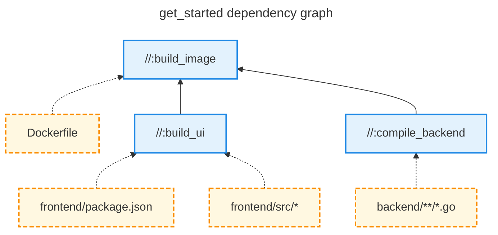

import { Tabs, TabItem } from "@astrojs/starlight/components";
import { Aside } from "@astrojs/starlight/components";

## What is Grog?

**Grog** is a lightweight build orchestrator that runs your existing commands in parallel —rebuilding only what’s changed— while caching the results for future runs.
It's designed to be a simple and lightweight alternative to existing build systems like [Bazel](https://bazel.build/), [Buck](https://buckbuild.com/), and [Pants](https://www.pantsbuild.org/).

Unlike those build systems, Grog remains agnostic to the actual build execution.
This means that you can keep using your existing scripts, Makefile rules, NPM commands, or any CLI you love—while grog transparently handles change detection, (remote) caching, and concurrent execution.
This allows small teams to get an immediate boost to their monorepo productivity without having to buy into a complex tool.

Read more in [Why Grog?](/why-grog).

## 1. Install Grog

<Tabs>
  <TabItem label="MacOS">
```shell
# Using Homebrew
brew tap chrismatix/grog
brew install grog

# Or download the binary
curl -L https://grog.build/latest/grog-darwin-arm64 -o /usr/local/bin/grog
chmod +x /usr/local/bin/grog

````
</TabItem>
<TabItem label="Linux">
```shell
# Download the binary
curl -L https://grog.build/latest/grog-linux-amd64 -o /usr/local/bin/grog
chmod +x /usr/local/bin/grog
````

  </TabItem>
</Tabs>

## 2. Initialize The Repository

To start using Grog in your project, you need to initialize it by creating a `grog.toml` file at the root of your repository:

```bash
touch grog.toml
```

A minimal `grog.toml` file can be empty, with all settings using default values.
Refer to the [configuration reference](/reference/configuration) to see all available options.

## 3. Define BUILD Files

`BUILD` files define your build targets.
Each target is a **command** that runs when its file **inputs** or **dependencies** change.
Grog provides a wide array of build file formats:

<Tabs>
  <TabItem label="YAML">
    ```yaml
    # BUILD.yaml
    targets:
      - name: build_ui
        command: npm run build:ui
        inputs:
          - frontend/src/**/*.{js,ts,jsx,tsx}
          - frontend/package.json
        outputs:
          - dir::frontend/dist

      - name: compile_backend
        command: go build -o backend/bin/app ./backend
        inputs:
          - backend/**/*.go
        outputs:
          - backend/bin/app

      - name: build_image
        command: >
          docker build \
          --file Dockerfile \
          --tag myorg/myapp:latest .
        dependencies:
          - :build_ui
          - :compile_backend
        inputs:
          - Dockerfile
        outputs:
          - docker::myorg/myapp:latest
    ```
    Save this as `BUILD.yaml` in your project directory.

  </TabItem>
  <TabItem label="JSON">
  ```json
  {
    "targets": [
      {
        "name": "build_ui",
        "command": "npm run build:ui",
        "inputs": [
          "frontend/src/**/*.{js,ts,jsx,tsx}",
          "frontend/package.json"
        ],
        "outputs": [
          "dir::frontend/dist"
        ]
      },
      {
        "name": "compile_backend",
        "command": "go build -o backend/bin/app ./backend",
        "inputs": [
          "backend/**/*.go"
        ],
        "outputs": [
          "backend/bin/app"
        ]
      },
      {
        "name": "build_image",
        "command": "docker build --file Dockerfile --tag myapp .",
        "dependencies": [
          ":build_ui",
          ":compile_backend"
        ],
        "inputs": [
          "Dockerfile"
        ],
        "outputs": [
          "docker::myapp"
        ]
      }
    ]
  }
    ```
  Save this as `BUILD.json` in your project directory.
  </TabItem>
  <TabItem label="Makefile">
```make

# @grog
# inputs:
#   - frontend/src/**/*.{js,ts,jsx,tsx}
#   - frontend/package.json
# outputs:
#   - dir::frontend/dist
build_ui:
  npm run build:ui

# @grog
# inputs:
#   - backend/**/*.go
# outputs:
#   - backend/bin/app
compile_backend:
  go build -o backend/bin/app ./backend

# @grog
# dependencies:
#   - :build_ui
#   - :compile_backend
# inputs:
#   - Dockerfile
# outputs:
#   - docker::myapp:latest
build_image:
  docker build --file Dockerfile --tag myapp:latest .

````

Add the grog metadata comments to your `Makefile` goals to allow running them with Grog.
</TabItem>
<TabItem label="Pkl">
```Pkl
amends "package://grog.build/releases/v0.9.3/grog@0.9.3#/package.pkl"

targets {
  new {
    name = "build_ui"
    command = "npm run build:ui"
    inputs {
      "frontend/src/**/*.{js,ts,jsx,tsx}"
      "frontend/package.json"
    }
    outputs {
      "dir::frontend/dist"
    }
  }

  new {
    name = "compile_backend"
    command = "go build -o backend/bin/app ./backend"
    inputs {
      "backend/**/*.go"
    }
    outputs {
      "backend/bin/app"
    }
  }

  new {
    name = "build_image"
    command = "docker build --file Dockerfile --tag myapp:latest ."
    dependencies {
      ":build_ui"
      ":compile_backend"
    }
    inputs {
      "Dockerfile"
    }
    outputs {
      "docker::myapp:latest"
    }
  }
}
````

Save this as `BUILD.pkl` in your project directory.

</TabItem>
</Tabs>

Things to note from the above examples:

- Targets are referenced using [labels](/reference/labels).
- Directory outputs are prefixed with `dir::` to indicate they are directories.
- Command definition `command` are executed as sh scripts in the target's directory.

## 4. Inspect the Build Graph

The build targets defined in the example above form a directed acyclic (build) graph (DAG).
You can visualize this graph using the [`grog graph`](/topics/querying) command:



This representation reveals a few things:

- Grog can and will build `compile_backend` and `build_ui` in parallel before building `build_image`.
- A change to any file in `backend/**/*.go` will trigger a rebuild of `compile_backend`. This will in turn trigger a rebuild of `build_image`.

## 5. Run Builds

To run a build, use the `grog build` command followed by the target label:

```bash
# Build a specific target
grog build //path/to/package:target_name

# Build all targets in and below a package
grog build //path/to/package/...

# Build all targets
grog build
```

Grog will re-run a build if any of the following conditions are met:

- A target's definition has changed.
- A target's inputs have changed.
- A target's dependencies have changed.

## 6. Run Tests

Grog will automatically treat targets that end with `test` as test targets.
They will only be executed if you run `grog test` and will be ignored for `grog build`

## Target Overview

Now we will look at the most important fields you can define on a target.
You can find the complete target configuration reference [here](/reference/target-configuration).

### Inputs

Inputs are files that your build target depends on. When any of these files change, Grog will re-run the target's command.
You can specify inputs using file paths or glob patterns:

```yaml
inputs:
  - "src/**/*.js"
  - package.json
  - "assets/*.{png,jpg}"
```

- `src/**/*.js` - All JavaScript files in src directory and subdirectories
- `package.json` - A specific file
- `assets/*.{png,jpg}` - All PNG and JPG files in assets directory

Grog tracks inputs by computing a hash of their contents.
This allows it to detect changes and only rebuild when necessary.

<Aside>
  You do not have to specify all files that your build target depends on for
  grog to work. However, it is recommended to specify all inputs to avoid
  unnecessary rebuilds.
</Aside>

### Dependencies

Dependencies are other targets that must be built before the current target.
This creates a directed acyclic graph (DAG) of build steps:

```yaml
dependencies:
  - :generate_proto
  - //lib:build_lib
```

- `generate_proto` - A dependency on another target in the same package
- `//lib:build_lib` - A dependency on a target in another package

When you specify dependencies:

- Grog ensures they are built before the current target.
- Changes to a dependency's outputs will trigger a rebuild of dependent targets.
- Grog can parallelize the build by running independent targets concurrently.

### Outputs

Outputs are artifacts that your build target produces and who you might want to share between machines using a remote cache.
Grog, therefore, caches these outputs and restores them when possible to avoid unnecessary rebuilds.

```yaml
outputs:
  - dist/bundle.js
  - dir::dist/assets/
  - docker::some-image
```

- `dist/bundle.js` - A file output
- `dir::dist/assets/` - A directory output
- `docker::some-image-tag` - A Docker image output

## Next Steps

Now that you've set up Grog and created your first build targets, you might want to explore:

- [Configuration Reference](/reference/configuration) - Learn about all available configuration options
- [Remote Caching](/topics/remote-caching) - Set up remote caching for your builds
- [Docker Outputs](/topics/docker-outputs) - Learn more about caching Docker images
- [Troubleshooting](/reference/troubleshooting) - Solve common issues
- [Shell Completions](/topics/shell-completions) - Enable target auto completion
