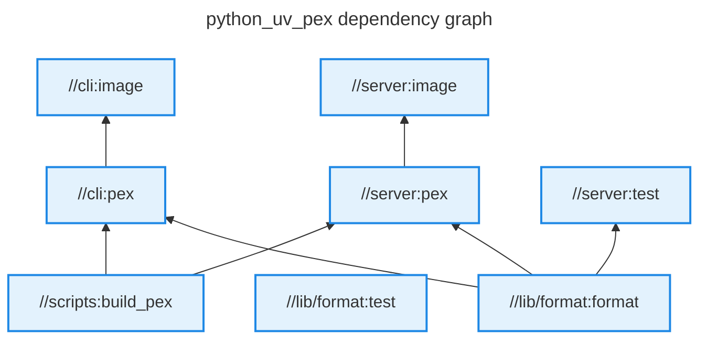
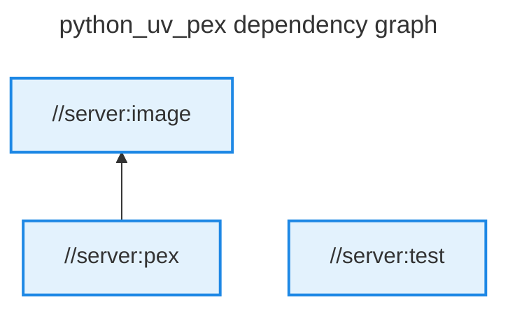
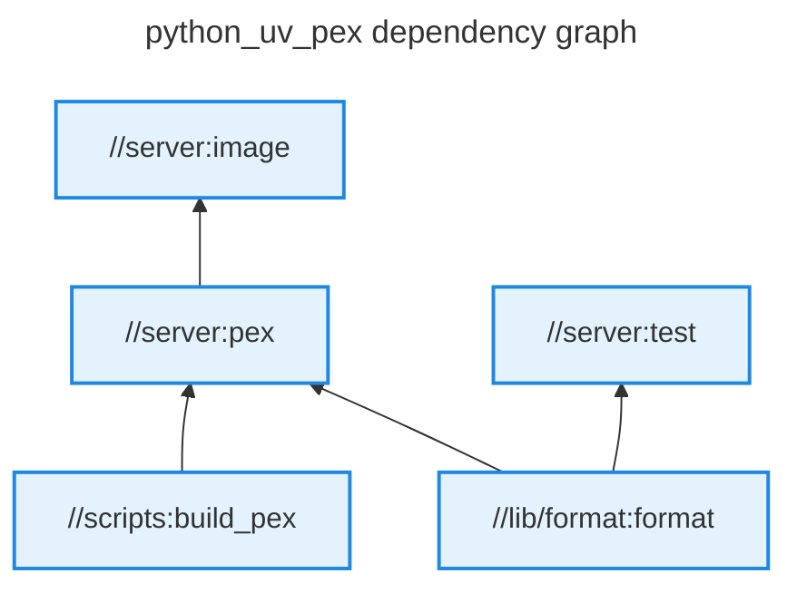
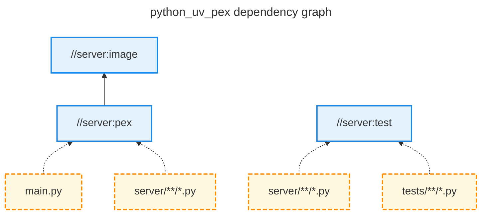

Visualizing your build graph can be a great way of documenting your project's interdependencies or to trace down a specific build issue.
Grog provides a `grog graph` command to visualize your build graph.
Below we will walk through the three different output formats that are supported:

- [Tree](#tree) (default)
- [Mermaid](#mermaid)
- [JSON](#json)

All examples will be based on the Python [example repository](https://github.com/chrismatix/grog/tree/main/examples/python_uv_pex) which contains a library that is shared by a server and a cli target.

## Mermaid

Running `grog graph -o mermaid` will generate a mermaid graph like this one:



Each node represents a Grog target and each edge represents a dependency.

We can isolate a part of the graph by passing a target pattern to the graph command:

```shell
grog graph -o mermaid //server/...
```

This will return the subgraph containing all the targets in the `server` package only:



This is useful for isolating the dependencies of a particular part of your repository.
If you also want to see the dependencies of the targets in the subgraph, you can pass the `--transitive` flag:

```shell
grog graph -t -o mermaid //server/...
```



Lastly, for the mermaid outputs only you can also add the file inputs as nodes to the graph:

```shell
grog graph --mermaid-inputs-as-nodes -o mermaid //server/...
```



## Tree (default)

When specifying `-o tree` as an output format, the graph will be printed as an ASCII tree.
The output also supports the `--transitive` flag and looks like so:

```shell
grog graph -o tree
```

```
//cli:image
╰── //cli:pex
    ├── //lib/format:format
    ╰── //scripts:build_pex
//lib/format:test
//server:image
╰── //server:pex
    ├── //lib/format:format
    ╰── //scripts:build_pex
//server:test
╰── //lib/format:format
```

The roots of the tree are the targets that have no dependencies.
As you can see, this means that unlike with the mermaid output dependencies can appear more than once in the output.

## JSON

Supplying `-o json` as an output format will print a single-line JSON that contains the target list in a field `vertices` and the edges in a field `edges`.
