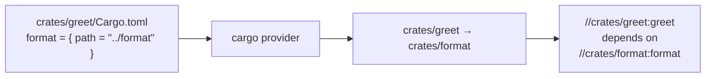

import { Aside, Tabs, TabItem } from "@astrojs/starlight/components";

Most monorepos state their internal dependency graph twice. Once for the language's package manager:

```toml
# crates/greet/Cargo.toml
[dependencies]
format = { path = "../format" }
```

and once for Grog:

```starlark
# crates/greet/BUILD.star
cargo_crate(name = "greet", deps = ["//crates/format"])
```

The second copy drifts. When it drifts _downward_ — the BUILD file lists fewer edges than Cargo does — Grog
under-invalidates: a change to `format` leaves `greet`'s cached test result in place and the build silently
passes on broken code.

**Dependency inference** deletes the second copy. A _dependency provider_ reads the graph your package manager
already resolved and hands it to Grog at load time. You keep writing `Cargo.toml`; Grog keeps the graph in sync.

<Aside type="note" title="Inference over-approximates, never under-approximates">
  Where a dependency is conditional — a `cfg(windows)` dependency, an optional feature, an environment marker —
  the built-in providers include it. An extra edge costs you a rebuild. A missing edge costs you correctness.
</Aside>

## Quick start

Two steps. First, declare a provider in the BUILD file of the directory your workspace is rooted at — for a
Cargo workspace, the repo root. `cargo` is [built in](#built-in-providers), so the declaration is a name and a
command:

<Tabs syncKey="build-file-format">
  <TabItem label="YAML">

```yaml
# BUILD.yaml at the workspace root
dependency_providers:
  - name: cargo
    command: builtin:cargo
```

  </TabItem>
  <TabItem label="Starlark">

```starlark
# BUILD.star at the workspace root
dependency_provider(
    name = "cargo",
    command = "builtin:cargo",
)
```

  </TabItem>
  <TabItem label="Pkl">

```pkl
// BUILD.pkl at the workspace root
amends "@grog/package.pkl"

dependency_providers {
  new {
    name = "cargo"
    command = "builtin:cargo"
  }
}
```

  </TabItem>
</Tabs>

Then point the target other packages depend on — usually the filegroup — at it by label, and delete your
hand-written dependencies:

<Tabs syncKey="build-file-format">
  <TabItem label="YAML">

```yaml
# crates/greet/BUILD.yaml
targets:
  - name: greet
    inputs:
      - src/**/*
      - Cargo.toml
    dependency_providers:
      - //:cargo
```

  </TabItem>
  <TabItem label="Starlark">

```starlark
# crates/greet/BUILD.star
target(
    name = "greet",
    inputs = ["src/**/*", "Cargo.toml"],
    dependency_providers = ["//:cargo"],
)
```

  </TabItem>
  <TabItem label="Pkl">

```pkl
// crates/greet/BUILD.pkl
amends "@grog/package.pkl"

targets {
  new {
    name = "greet"
    inputs {
      "src/**/*"
      "Cargo.toml"
    }
    dependency_providers {
      "//:cargo"
    }
  }
}
```

  </TabItem>
</Tabs>

That is the whole setup — no `grog.toml`, no script to install, no code generation step. Every crate that names
the provider gets its path dependencies wired automatically:

```bash
$ grog deps //crates/cli:cli
//crates/greet:greet
//tools/grog:rust
```

In a [helper library](/guides/rust) the field is set once and every crate stops passing `deps` entirely:

<Tabs syncKey="build-file-format">
  <TabItem label="Starlark">

```starlark
# tools/grog/rust.star
def cargo_crate(name, bin = False):
    target(
        name = name,
        inputs = ["src/**/*", "Cargo.toml"],
        dependencies = ["//tools/grog:rust"],
        dependency_providers = ["//:cargo"],
    )
    # ...build, test and lint targets depend on ":" + name as before
```

```starlark
# crates/greet/BUILD.star
load("//tools/grog/rust.star", "cargo_crate")

cargo_crate(name = "greet")
```

  </TabItem>
  <TabItem label="Pkl">

```pkl
// tools/grog/rust.pkl
class Crate {
  local self = this

  name: String
  bin: Boolean = false

  fixed targets: Listing<package.Target> = new Listing<package.Target> {
    new {
      name = self.name
      inputs {
        "src/**/*"
        "Cargo.toml"
      }
      dependencies {
        "//tools/grog:rust"
      }
      dependency_providers {
        "//:cargo"
      }
    }
    // ...build, test and lint targets depend on ":\(self.name)" as before
  }
}
```

```pkl
// crates/greet/BUILD.pkl
amends "@grog/package.pkl"

import ".../tools/grog/rust.pkl"

targets {
  ...new rust.Crate { name = "greet" }.targets
}
```

  </TabItem>
</Tabs>

## How the wiring works

Package managers describe dependencies between **directories**. Grog describes them between **labels**. A
provider bridges the two by emitting directory-to-directory edges; naming a provider on a target says "this
target represents my package to that provider".

The directories a provider talks about are relative to **the package the provider is declared in**. Declare
`//:cargo` at the repo root and it speaks workspace-relative paths; declare `//tools/rust:cargo` and its
`crates/format` means `tools/rust/crates/format`. That one rule is why there is no working-directory setting to
configure.



Three rules cover the whole model:

1. **Naming a provider registers the target.** `dependency_providers = ["//:cargo"]` marks that target as its
   package's endpoint for that provider. At most one target per package may register a given provider.
2. **The registered target receives the package's edges** as additional `dependencies`, and is also what other
   packages' edges point _at_.
3. **There is no naming convention.** The registration is the link, so `//crates/format:format`,
   `//crates/format:sources` and `//crates/format:lib` all work. Explicit `dependencies` are kept and merged
   with the inferred ones.

Because every other target in the package already depends on the filegroup, `:build`, `:test` and `:lint` inherit
every inferred edge without being touched.

A target may register with several providers and receives the union — useful when a package is both a workspace
member and a consumer of generated code:

```starlark
target(
    name = "server",
    inputs = ["server/**/*.py", "pyproject.toml"],
    dependency_providers = ["//:uv", "//:proto"],
)
```

## Built-in providers

Four providers ship with Grog. Write `command = "builtin:<name>"` on a declaration and leave `inputs` off to
take the defaults below; nothing else is required.

| Name    | Reads                                                                                             | Needs a toolchain |
| ------- | ------------------------------------------------------------------------------------------------- | ----------------- |
| `cargo` | The workspace `Cargo.toml` members and each member's `[dependencies]` / `[build-dependencies]`     | no                |
| `uv`    | `uv.lock` — packages with an `editable` or `directory` source are workspace members                | no                |
| `node`  | `pnpm-workspace.yaml`, or `workspaces` in the root `package.json`, plus each member's dependencies | no                |
| `go`    | `go list -deps -e -json ./...`, keeping imports under the module path                              | yes (`go`)        |

Three of the four parse manifests and lockfiles directly, so they work on a fresh clone with no language
toolchain installed at all — `grog changes` on a slim CI image does not need Cargo or uv.

### cargo

Members come from `[workspace] members` in the root manifest; edges come from `path` dependencies between them.
`[dev-dependencies]` are **excluded** — Cargo permits `A dev-depends-on B, B depends-on A`, and importing those
edges would turn a legal Cargo workspace into a Grog dependency cycle. If a test genuinely needs a workspace
crate that is not also a normal dependency, add that one label by hand to the `:test` target.

Default `inputs`, relative to the declaring package: `Cargo.toml`, `*/Cargo.toml`, `*/*/Cargo.toml`, `Cargo.lock`.

### uv

Workspace members are the `uv.lock` packages whose source is `{ editable = "<dir>" }` or `{ directory = "<dir>" }`;
edges are their `dependencies` and `dev-dependencies` that name other members. Dev dependencies _are_ included
here — a uv workspace graph is acyclic by construction.

Default `inputs`: `uv.lock`, `pyproject.toml`.

<Aside type="caution">
  The provider reads the lockfile, not your imports. A stale `uv.lock` yields a stale graph — keep `uv sync`
  or `UV_LOCKED=1` in your CI so the lockfile cannot drift from the manifests.
</Aside>

### node

One provider covers npm, yarn and pnpm workspaces: only the file listing the member globs differs
(`pnpm-workspace.yaml`, else `workspaces` in the root `package.json`), while the edge rule — a
`dependencies`, `devDependencies` or `peerDependencies` entry whose _name_ matches another workspace member — is
identical in all three. pnpm's `workspace:*` protocol is a version spec, not a different graph.

Default `inputs`: `pnpm-workspace.yaml`, `package.json`, `*/package.json`, `*/*/package.json`.

### go

Import edges between directories inside your module(s), from `go list`. This is the one built-in that shells out
to its toolchain and the one where a large repo notices the cost, so it is also the one that benefits most from
[provider caching](#caching). Test-only imports are excluded for the same cycle reason as Cargo's
`[dev-dependencies]`.

Default `inputs`: `go.mod`, `go.sum`, `go.work`, `**/*.go`.

## Fields reference

### Target field

| Field                  | Type       | Description                                                                                        |
| ---------------------- | ---------- | ---------------------------------------------------------------------------------------------------- |
| `dependency_providers` | `label[]`  | Labels of the provider declarations this target registers with. Inferred edges are merged into `dependencies`. |

Ordinary label rules apply: `":cargo"` addresses a provider declared in the same package, `"//:cargo"` one
declared at the workspace root. Available in `BUILD.yaml`, `BUILD.json`, `BUILD.star`, `BUILD.pkl` and in
[Grog script](/topics/grog-scripts) annotations, with identical semantics.

### Provider declaration

A provider is declared in a BUILD file, alongside `targets`, `aliases` and `resources`:

<Tabs syncKey="build-file-format">
  <TabItem label="YAML">

```yaml
dependency_providers:
  - name: cargo
    command: builtin:cargo
    inputs:
      - Cargo.toml
      - Cargo.lock
      - crates/*/Cargo.toml
```

  </TabItem>
  <TabItem label="Starlark">

```starlark
dependency_provider(
    name = "cargo",
    command = "builtin:cargo",
    inputs = ["Cargo.toml", "Cargo.lock", "crates/*/Cargo.toml"],
)
```

  </TabItem>
  <TabItem label="Pkl">

```pkl
dependency_providers {
  new {
    name = "cargo"
    command = "builtin:cargo"
    inputs {
      "Cargo.toml"
      "Cargo.lock"
      "crates/*/Cargo.toml"
    }
  }
}
```

  </TabItem>
</Tabs>

| Field     | Type       | Description                                                                                                    |
| --------- | ---------- | ---------------------------------------------------------------------------------------------------------------- |
| `name`    | `string`   | Unique within the package. Shares the namespace with targets, aliases and resources.                           |
| `command` | `string`   | Shell command printing the [mapping](#the-provider-protocol) to stdout, or `builtin:<name>` for a shipped one.  |
| `inputs`  | `string[]` | Globs relative to the declaring package whose contents form the [cache key](#caching). Defaults to the built-in's. |
| `timeout` | `string`   | Bounds the command. Defaults to `60s` — a provider runs on read-path commands, so it may not hang them. |

<Aside type="note" title="A provider is not a build target">
  Declarations are loaded, never scheduled. A provider has no `dependencies` and no `outputs`, `grog build
  //...` does not build it, and it never appears in `grog deps`. It cannot consume another target's output — a
  provider that needs generated code has to generate it itself. That restriction is what keeps `grog deps`,
  `grog changes` and shell completion from ever triggering a build.
</Aside>

<Aside type="tip">
  `dependency_providers` at the package level is a list of declarations; on a target it is a list of labels
  referencing them. Same word, two positions — the values tell them apart.
</Aside>

## Tweaking the built-ins

### Narrowing the inputs

The default `inputs` are deliberately broad. If your crates all live two levels deep, say so — the globs are
resolved on every load, and a `**` pattern over a large repo is a second tree walk:

```starlark
dependency_provider(
    name = "cargo",
    command = "builtin:cargo",
    inputs = ["Cargo.toml", "Cargo.lock", "crates/*/Cargo.toml"],
)
```

### A second workspace of the same ecosystem

Declare a second provider in that workspace's own package. Its paths are relative to where it is declared, so
targets under `tools/rust/crates/*` get correct labels with nothing else to configure:

```starlark
# tools/rust/BUILD.star
dependency_provider(name = "cargo", command = "builtin:cargo")
```

```starlark
# tools/rust/crates/codegen/BUILD.star
target(name = "codegen", dependency_providers = ["//tools/rust:cargo"], ...)
```

### Replacing a built-in

Change `command`. There is nothing else to override — the built-in is a value of one field, not a separate
configuration layer:

```starlark
dependency_provider(
    name = "cargo",
    command = "python3 tools/grog/cargo_provider.py",
    inputs = ["Cargo.toml", "crates/*/Cargo.toml"],
)
```

## Writing a custom provider

A provider is any command that prints a JSON document. Nothing else — no plugin API, no linking against Grog.
Implementing one is four steps:

1. Write an executable in whatever language you like that prints the [document](#the-provider-protocol) to
   stdout.
2. Declare it with `dependency_provider`, giving it the `inputs` its answer depends on.
3. Reference it by label from the targets that should receive its edges.
4. Run `grog check` to see the package and edge counts it produced, and `grog deps` on a target to see the
   merged result.

### The provider protocol

**Requirements on the command.** Five, and they follow from where it runs — on the load path, on every
command that reads the graph, with its output cached:

1. **Side-effect free.** It may run concurrently with other providers, and on a cache hit it does not run at
   all, so nothing may depend on it having run. It must not write into the workspace. This bites in a
   non-obvious place: bare `cargo metadata` will re-resolve and rewrite `Cargo.lock`, which is why the built-in
   passes `--locked`.
2. **Deterministic.** Same inputs, same bytes. Absolute paths, timestamps and map iteration order in the output
   all churn the cache key and invalidate targets for nothing.
3. **stdout is the document and nothing else.** Diagnostics go to stderr, which Grog reports verbatim on
   failure and logs at debug on success. stdout is the artifact that gets cached.
4. **Non-interactive.** stdin is closed. A provider that prompts hangs every `grog` command, including shell
   completion.
5. **Bounded.** It must finish within the declaration's `timeout` (default `60s`).

**Invocation.** The command runs through the same shell as target commands (including the default `set -eu`,
subject to [`disable_default_shell_flags`](/reference/configuration)), with the working directory set to the
package the provider is declared in. Its environment is what a target command gets: the process environment,
`grog.toml` `environment_variables`, the `GROG_*` variables, plus `GROG_PROVIDER_LABEL`.

**Output.** One JSON document on stdout:

```json
{
  "version": 1,
  "packages": {
    "crates/cli": { "dependencies": ["crates/greet"] },
    "crates/format": { "dependencies": [] },
    "crates/greet": { "dependencies": ["crates/format"] },
    "crates/server": { "dependencies": ["crates/greet"] }
  }
}
```

- Keys are slash-separated **directory paths** relative to the declaring package. `""` is that package itself.
- Paths must be relative, `/`-separated, without a leading `./`, a trailing `/`, or any `..` segment. A path
  that escapes the declaring package or arrives absolute is a load error rather than something Grog silently
  normalises.
- Entries in `dependencies` are the same kind of path — with one escape hatch: an entry starting with `//` is
  taken as a literal Grog label, for when you need to point at a specific target rather than a package's
  registered one.
- A package may be omitted entirely; that means the same as an empty `dependencies` list. List every workspace
  member anyway so the counts `grog check` reports are meaningful.
- A package listing itself is dropped, not an error.
- Order does not matter. Grog sorts every list before merging, so a provider that shuffles its output produces
  byte-identical results and no cache churn.
- Unknown fields are ignored, so newer providers stay loadable. `version` is required.

**Exit status.** Zero with a valid document, or non-zero with a message on stderr, which Grog reports verbatim.
There is no partial success: a provider that cannot determine the graph must fail rather than emit a subset,
because a missing edge is the exact bug inference exists to prevent.

### A worked example

Say `protoc` output is consumed by packages that share no package manager, as in
[`examples/codegen`](https://github.com/chrismatix/grog/tree/main/examples/codegen). A provider that maps each
consumer directory to the codegen target is about a dozen lines:

```python
#!/usr/bin/env python3
# tools/grog/proto_provider.py
import json
import sys
from pathlib import Path

CODEGEN_LABEL = "//src/protobuf:codegen"

packages = {}
for source_file in Path("src").rglob("*"):
    if source_file.suffix not in {".go", ".py", ".rs"}:
        continue
    if "pb." not in source_file.read_text(errors="ignore"):
        continue
    package_directory = str(source_file.parent.relative_to("."))
    packages.setdefault(package_directory, {"dependencies": [CODEGEN_LABEL]})

json.dump({"version": 1, "packages": packages}, sys.stdout)
```

Declare it and name it from the consumers:

```starlark
# BUILD.star at the workspace root
dependency_provider(
    name = "proto",
    command = "python3 tools/grog/proto_provider.py",
    inputs = ["src/**/*.proto", "src/**/*.go", "src/**/*.py", "src/**/*.rs"],
)
```

<Tabs syncKey="build-file-format">
  <TabItem label="YAML">

```yaml
targets:
  - name: go
    command: go build ./...
    inputs:
      - "**/*.go"
    dependency_providers:
      - //:proto
```

  </TabItem>
  <TabItem label="Starlark">

```starlark
target(
    name = "go",
    command = "go build ./...",
    inputs = ["**/*.go"],
    dependency_providers = ["//:proto"],
)
```

  </TabItem>
  <TabItem label="Pkl">

```pkl
new {
  name = "go"
  command = "go build ./..."
  inputs {
    "**/*.go"
  }
  dependency_providers {
    "//:proto"
  }
}
```

  </TabItem>
</Tabs>

<Aside type="tip" title="Cross-language often needs no custom provider">
  If the generated package is _also_ a workspace member — as `lib/proto` is in the
  [uv example](/guides/python) — the language provider already emits the edge. Reach for a custom provider only
  when no package manager spans the boundary.
</Aside>

## Caching

Providers run **at load time**, so their cost lands on every `grog build`, `grog test`, `grog changes` and shell
completion. Grog therefore caches provider output the same way it caches target output.

The cache key is a hash of the protocol version, the provider's label, its resolved `command`, and the contents
of every file matching `inputs` — resolved by exactly the same globbing that resolves a target's inputs. The
value is the provider's stdout, stored in the [content-addressable store](/topics/remote-caching), so with a
remote cache configured a cold CI runner downloads the mapping instead of running `go list`.

What that costs in practice:

| | Work |
| --- | --- |
| Cache hit | Hash the `inputs` files, one cache read, one JSON parse |
| Cache miss | The above plus one subprocess |
| No provider referenced | Nothing at all — providers only run when a target names them |

Failed runs are never cached, and because the key is content-addressed a stale entry cannot win. Provider
caching follows the global cache setting, so `--enable-cache=false` re-runs providers on every load.

<Aside type="caution" title="Providers must be deterministic">
  Sorting handles ordering noise, but a provider whose _content_ varies between runs — absolute paths,
  timestamps, a resolver that is not stable — will churn the cache key and invalidate targets for no reason.
</Aside>

## Using a committed mapping

If you would rather not run a tool at load time at all — a locked-down CI image, or a provider that is too slow
even cached — commit the mapping and read it back with `cat`:

```starlark
# BUILD.star at the workspace root
dependency_provider(
    name = "cargo",
    command = "cat tools/grog/inferred-deps.json",
    inputs = ["tools/grog/inferred-deps.json"],
)
```

Then keep the file honest with an ordinary Grog target:

```yaml
# tools/grog/BUILD.yaml
targets:
  - name: inferred-deps
    command: python3 cargo_provider.py > inferred-deps.json
    inputs:
      - cargo_provider.py
    dependencies:
      - //:workspace
    outputs:
      - inferred-deps.json
```

This gives you the fully reproducible, toolchain-free story of a code-generation approach without a second
mechanism to learn — but note that the file can now drift between regenerations, which is precisely what live
providers avoid. Use it when you need it, not by default.

## Inspecting and troubleshooting

Inferred edges are ordinary dependencies, so every query command shows them:

```bash
grog deps //crates/cli:cli          # direct dependencies, inferred ones included
grog rdeps //crates/format:format   # who depends on this crate
grog graph -o mermaid               # the whole graph
```

`grog check` runs every referenced provider and reports what it found:

```bash
$ grog check
provider //:cargo: builtin:cargo, cache hit, 4 packages, 3 edges
Build graph is valid.
```

Run with `--log-level debug` to see each provider's command, cache key and full mapping.

### Errors

| Message | Cause and fix |
| --- | --- |
| `no dependency provider at //:cargo2 (referenced by //crates/cli:cli); declared: //:cargo, //:proto` | A typo, or a declaration you have not written yet. |
| `provider //:cargo registered twice in package crates/cli: //crates/cli:cli and //crates/cli:build` | Only one target per package may register a provider. Register the filegroup and let the rest depend on it. |
| `provider //:cargo reports crates/greet depends on crates/format, which has no target registered for //:cargo` | A workspace member with no BUILD file, or one whose target does not name the provider. Add the field, or remove the crate from the workspace. |
| `provider //:cargo failed: exec: "cargo": executable file not found in $PATH` | The provider's tool is missing. Install it, warm the remote cache, or switch to a [committed mapping](#using-a-committed-mapping). |
| `cycle detected: //crates/a:a -> //crates/b:b -> //crates/a:a` | The inferred graph is cyclic. Usually a dev-dependency edge from a custom provider — see [limitations](#limitations). |

A workspace member that has **no** registered target at all is ignored, not an error: a repo may legitimately
contain packages Grog does not build. It is only an error when a package Grog _does_ build depends on one.

## Interaction with `grog changes`

[`grog changes`](/reference/commands) loads the graph at the current revision, so inferred edges are always
up to date. Two details are worth knowing:

- Adding a dependency usually touches a manifest that is already an input of the receiving target
  (`Cargo.toml`, `pyproject.toml` and `package.json` are inputs in every guide's helper library), so the change
  is detected the ordinary way and `--dependents=transitive` propagates it.
- For a manifest that is _not_ any target's input — most importantly a root workspace file adding or removing
  members — Grog falls back to a conservative rule: if any file matched by a provider's `inputs` appears in the
  diff, every target registered with that provider counts as changed.

## Limitations

- **Dev dependencies and test-only imports are excluded** by the `cargo` and `go` providers. Both ecosystems
  permit cycles there, and because inferred edges land on the package filegroup that every target depends on,
  importing them would turn legal workspaces into Grog cycles. Add those labels by hand on the `:test` target.
- **Conditional dependencies are included unconditionally.** A `cfg(windows)`-only crate is an edge on Linux
  too. If that crate has no BUILD file you will get the "no target registered" error on every platform.
- **One registered target per package.** Packages needing different inferred graphs for different targets are
  not expressible today; split the package or add the extra labels by hand.
- **Providers run before the build, not as part of it.** They cannot depend on build outputs. A provider that
  needs generated code has to generate it itself.
