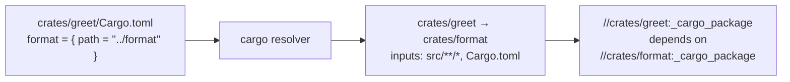

import { Aside, Tabs, TabItem } from "@astrojs/starlight/components";

Most monorepos state their internal dependency graph twice. Once for the language's package manager:

```toml
# crates/greet/Cargo.toml
[dependencies]
format = { path = "../format" }
```

and once for Grog:

```starlark
# crates/greet/BUILD.star
cargo_crate(name = "greet", deps = ["//crates/format"])
```

The second copy drifts. If the BUILD file ends up with fewer edges than Cargo has, Grog under-invalidates: a
change to `format` leaves `greet`'s cached test result in place, and the build passes on broken code.

Dependency inference removes the second copy. A _dependency resolver_ reads the graph your package manager
already resolved and hands it to Grog at load time.

<Aside type="note" title="Inference over-approximates, never under-approximates">
  Conditional dependencies — a `cfg(windows)` dependency, an optional feature, an environment marker
  — are included. An extra edge costs a rebuild; a missing edge costs correctness.
</Aside>

## Quick start

Declare a resolver in the BUILD file of the directory your workspace is rooted at, which for a Cargo workspace
is the repo root. `cargo` is [built in](#built-in-resolvers), so the declaration is a name and a command:

<Tabs syncKey="build-file-format">
  <TabItem label="YAML">

```yaml
# BUILD.yaml at the workspace root
dependency_resolvers:
  - name: cargo
    command: builtin:cargo
```

  </TabItem>
  <TabItem label="Starlark">

```starlark
# BUILD.star at the workspace root
dependency_resolver(
    name = "cargo",
    command = "builtin:cargo",
)
```

  </TabItem>
  <TabItem label="Pkl">

```pkl
// BUILD.pkl at the workspace root
amends "@grog/package.pkl"

dependency_resolvers {
  new {
    name = "cargo"
    command = "builtin:cargo"
  }
}
```

  </TabItem>
</Tabs>

Every crate in the workspace now has a filegroup, `//crates/<name>:_cargo_package`. Its inputs come from the crate's
layout and its dependencies from the crate's `path` entries, and it exists whether or not the crate has a BUILD
file:

```bash
$ grog deps //crates/cli:_cargo_package
//crates/greet:_cargo_package
```

Targets that build or test a crate depend on that label and list nothing else:

<Tabs syncKey="build-file-format">
  <TabItem label="YAML">

```yaml
# crates/greet/BUILD.yaml
targets:
  - name: test
    command: cargo test -p greet
    dependencies:
      - :_cargo_package
```

  </TabItem>
  <TabItem label="Starlark">

```starlark
# crates/greet/BUILD.star
target(
    name = "test",
    command = "cargo test -p greet",
    dependencies = [":_cargo_package"],
)
```

  </TabItem>
  <TabItem label="Pkl">

```pkl
// crates/greet/BUILD.pkl
amends "@grog/package.pkl"

targets {
  new {
    name = "test"
    command = "cargo test -p greet"
    dependencies {
      ":_cargo_package"
    }
  }
}
```

  </TabItem>
</Tabs>

Adding a source file, a `build.rs`, or a path dependency to `Cargo.toml` needs no BUILD file edit. In a
helper library the pattern collapses to `cargo_crate(name = "greet")`.

## How the wiring works

Package managers describe dependencies between directories; Grog describes them between labels. A resolver
bridges the two: for each package directory it reports the directories that package depends on and, optionally,
the files that make it up.

Those directories are relative to the package the resolver is declared in. `//:cargo` at the repo root speaks
workspace-relative paths; `//tools/rust:cargo` reads its `crates/format` as `tools/rust/crates/format`. That is
why there is no working-directory setting.



Each reported package ends up with exactly one target standing in for it, chosen by three rules:

1. A target that names the resolver in `dependency_resolvers` is the package's endpoint. It receives the
   package's edges as additional `dependencies`, other packages' edges point at it, and the resolver's `inputs`
   for the package are ignored in favour of its own. At most one target per package may register a resolver.
2. Otherwise, if the resolver declared `inputs` for the package, Grog synthesizes a filegroup named
   `_<resolver name>_package` from them — `//crates/format:_cargo_package`. Its defining file, for `grog changes` and error
   messages, is the BUILD file that declared the resolver. A directory with no BUILD file at all gets a package
   this way.
3. Otherwise the package is outside the resolver's graph. That is fine until something depends on it, which is a
   load error.

Registration is for the cases where you know the inputs better than the resolver does — a package with a
generated directory, say. Register a filegroup with your own `inputs` and `dependency_resolvers = ["//:cargo"]`,
and the edges still arrive. A target may register with several resolvers and receives the union:

```starlark
target(
    name = "server",
    inputs = ["server/**/*.py", "pyproject.toml"],
    dependency_resolvers = ["//:uv", "//:proto"],
)
```

## Built-in resolvers

Four resolvers ship with Grog. Write `command = "builtin:<name>"` and leave `inputs` off to take the defaults
below. Every built-in declares inputs for each package it reports, so a workspace member needs no BUILD file to
be depended on.

| Name    | Reads                                                                                              | Needs a toolchain |
| ------- | -------------------------------------------------------------------------------------------------- | ----------------- |
| `cargo` | The workspace `Cargo.toml` members and each member's `[dependencies]` / `[build-dependencies]`     | no                |
| `uv`    | `uv.lock` — packages with an `editable` or `directory` source are workspace members                | no                |
| `node`  | `pnpm-workspace.yaml`, or `workspaces` in the root `package.json`, plus each member's dependencies | no                |
| `go`    | `go list -deps -e -json ./...`, keeping imports under the module path                              | yes (`go`)        |

Three of the four parse manifests and lockfiles directly, so they work on a fresh clone with no language
toolchain installed. `grog changes` on a slim CI image does not need Cargo or uv.

### cargo

Members come from `[workspace] members` minus `exclude` in the root manifest, plus the root package itself when
that manifest has a `[package]` table. Edges come from `path` dependencies between members, including ones
declared as `workspace = true` and resolved through `[workspace.dependencies]`.
`[dev-dependencies]` are excluded, because Cargo permits `A dev-depends-on B, B depends-on A` and importing
those edges would turn a legal workspace into a Grog cycle. If a test needs a workspace crate that is not also a
normal dependency, add that label by hand to the `:test` target.

Default `inputs`, relative to the declaring package: `Cargo.toml`, `Cargo.lock`, and `<pattern>/Cargo.toml` for
every `[workspace] members` pattern, so a member at any depth is covered.

Each crate's synthesized `:_cargo_package` is a deliberate superset of its layout: `Cargo.toml`, `build.rs`, `src/**/*`,
`tests/**/*`, `benches/**/*`, `examples/**/*`, plus `[lib] path`, `[[bin]] path` and `[package] include`. A
listed file the crate does not have is skipped when hashing; one left out would under-invalidate silently.

### uv

Workspace members are the `uv.lock` packages whose source is `{ editable = "<dir>" }` or `{ directory = "<dir>" }`;
edges are their `dependencies` that name other members. Dev groups are excluded for the same reason as Cargo's
`[dev-dependencies]`: uv does not forbid cycles between members, and a test-only edge back to a dependant is the
common way to get one.

Default `inputs`: `uv.lock`, `pyproject.toml`.

<Aside type="caution">
  The resolver reads the lockfile, not your imports. A stale `uv.lock` yields a stale graph, so keep
  `uv sync` or `UV_LOCKED=1` in CI.
</Aside>

### node

One resolver covers npm, yarn and pnpm workspaces. Only the file listing the member globs differs
(`pnpm-workspace.yaml`, else `workspaces` in the root `package.json`). The edge rule is identical in all three:
a `dependencies`, `devDependencies` or `peerDependencies` entry whose name matches another member. pnpm's
`workspace:*` protocol is a version spec, not a different graph.

Default `inputs`: `pnpm-workspace.yaml`, `package.json`, `*/package.json`, `*/*/package.json`.

### go

Import edges between directories inside your module(s), from `go list`. Imports are taken from every `.go` file
in a package, including files that build constraints exclude on the current platform, so a `worker_windows.go`
import is an edge on Linux too and the mapping does not depend on `GOOS`, `GOARCH` or build tags. This is the
only built-in that shells out to its toolchain, so it is slow on a large repo and benefits most from
[resolver caching](#caching). Test-only imports are excluded for the same cycle reason as Cargo's
`[dev-dependencies]`.

Default `inputs`: `go.mod`, `go.sum`, `go.work`, `**/*.go`.

## Fields reference

### Target field

| Field                  | Type      | Description                                                                                                    |
| ---------------------- | --------- | -------------------------------------------------------------------------------------------------------------- |
| `dependency_resolvers` | `label[]` | Labels of the resolver declarations this target registers with. Inferred edges are merged into `dependencies`. |

Ordinary label rules apply: `":cargo"` addresses a resolver declared in the same package, `"//:cargo"` one
declared at the workspace root. Available in `BUILD.yaml`, `BUILD.json`, `BUILD.star`, `BUILD.pkl` and in
[Grog script](/topics/grog-scripts) annotations, with identical semantics.

### Resolver declaration

A resolver is declared in a BUILD file, alongside `targets`, `aliases` and `resources`:

<Tabs syncKey="build-file-format">
  <TabItem label="YAML">

```yaml
dependency_resolvers:
  - name: cargo
    command: builtin:cargo
    inputs:
      - Cargo.toml
      - Cargo.lock
      - crates/*/Cargo.toml
```

  </TabItem>
  <TabItem label="Starlark">

```starlark
dependency_resolver(
    name = "cargo",
    command = "builtin:cargo",
    inputs = ["Cargo.toml", "Cargo.lock", "crates/*/Cargo.toml"],
)
```

  </TabItem>
  <TabItem label="Pkl">

```pkl
dependency_resolvers {
  new {
    name = "cargo"
    command = "builtin:cargo"
    inputs {
      "Cargo.toml"
      "Cargo.lock"
      "crates/*/Cargo.toml"
    }
  }
}
```

  </TabItem>
</Tabs>

| Field     | Type       | Description                                                                                                        |
| --------- | ---------- | ------------------------------------------------------------------------------------------------------------------ |
| `name`    | `string`   | Unique within the package. Shares the namespace with targets, aliases and resources.                               |
| `command` | `string`   | Shell command printing the [mapping](#the-resolver-protocol) to stdout, or `builtin:<name>` for a shipped one.     |
| `inputs`  | `string[]` | Globs relative to the declaring package whose contents form the [cache key](#caching). Defaults to the built-in's. |
| `timeout` | `string`   | Bounds the command. Defaults to `60s` — a resolver runs on read-path commands, so it may not hang them.            |

<Aside type="note" title="A resolver is not a build target">
  Declarations are loaded, never scheduled. A resolver has no `dependencies` and no `outputs`, `grog
  build //...` does not build it, and it never appears in `grog deps`. It cannot consume another
  target's output; one that needs generated code has to generate it itself. That is what keeps `grog
  deps`, `grog changes` and shell completion from triggering a build.
</Aside>

## Tweaking the built-ins

### Narrowing the inputs

The defaults are broad. Narrow them if you can: the globs are resolved on every load, and a `**` pattern over a
large repo costs a second tree walk.

```starlark
dependency_resolver(
    name = "cargo",
    command = "builtin:cargo",
    inputs = ["Cargo.toml", "Cargo.lock", "crates/*/Cargo.toml"],
)
```

### A second workspace of the same ecosystem

Declare a second resolver in that workspace's own package. Its paths are relative to where it is declared, so
targets under `tools/rust/crates/*` resolve correctly with nothing else to configure:

```starlark
# tools/rust/BUILD.star
dependency_resolver(name = "cargo", command = "builtin:cargo")
```

```starlark
# tools/rust/crates/codegen/BUILD.star
target(name = "codegen", dependency_resolvers = ["//tools/rust:cargo"], ...)
```

### Replacing a built-in

Change `command`. There is nothing else to override: the built-in is a value of one field, not a separate
configuration layer.

```starlark
dependency_resolver(
    name = "cargo",
    command = "python3 tools/grog/cargo_resolver.py",
    inputs = ["Cargo.toml", "crates/*/Cargo.toml"],
)
```

## Writing a custom resolver

A resolver is any command that prints a JSON document. There is no plugin API and nothing to link against.

1. Write an executable, in any language, that prints the [document](#the-resolver-protocol) to stdout.
2. Declare it with `dependency_resolver`, giving it the `inputs` its answer depends on.
3. Either emit `inputs` for each package so Grog synthesizes its filegroup, or reference the resolver by
   label from a target in each package that should stand in for it.
4. Run `grog check` for the package and edge counts, and `grog deps` on a target for the merged result.

### The resolver protocol

**Requirements on the command.** These follow from where it runs: on the load path, on every command that
reads the graph, with its output cached.

1. **Side-effect free.** It may run concurrently with other resolvers, and on a cache hit it does not run at
   all, so nothing may depend on it having run. It must not write into the workspace. Bare `cargo metadata`
   violates this — it re-resolves and rewrites `Cargo.lock` — which is why the built-in passes `--locked`.
2. **Deterministic.** Same inputs, same bytes. Absolute paths, timestamps and map iteration order in the output
   all churn the cache key and invalidate targets for nothing.
3. **stdout carries the document and nothing else.** Diagnostics go to stderr, reported verbatim on failure and
   logged at debug on success. stdout is what gets cached.
4. **Non-interactive.** stdin is the null device, so a read returns EOF. A resolver that waits for input hangs
   every `grog` command, including shell completion.
5. **Bounded.** It must finish within the declaration's `timeout` (default `60s`).
6. **Complete.** Report every edge whose change should rebuild the importing package, including conditional
   ones, and, for every package you declare `inputs` for, every file whose change should rebuild it. An omitted
   edge or file is the silent staleness inference exists to remove, and nothing downstream can detect it. The
   built-in resolvers over-approximate for this reason, and a resolver you write should too.

**Invocation.** The command runs through the same shell as target commands (including the default `set -eu`,
subject to [`disable_default_shell_flags`](/reference/configuration)), with the working directory set to the
package the resolver is declared in. Its environment is what a target command gets: the process environment,
`grog.toml` `environment_variables`, the `GROG_*` variables, plus `GROG_RESOLVER_LABEL`.

**Output.** One JSON document on stdout:

```json
{
  "version": 1,
  "packages": {
    "crates/cli": { "dependencies": ["crates/greet"], "inputs": ["src/**/*", "Cargo.toml"] },
    "crates/format": { "dependencies": [], "inputs": ["src/**/*", "Cargo.toml"] },
    "crates/greet": { "dependencies": ["crates/format"], "inputs": ["src/**/*", "Cargo.toml"] },
    "crates/server": { "dependencies": ["crates/greet"], "inputs": ["src/**/*", "Cargo.toml"] }
  }
}
```

- Keys are slash-separated **directory paths** relative to the declaring package. `""` is that package itself.
- Paths must be relative, `/`-separated, without a leading `./`, a trailing `/`, or any `..` segment. A path
  that escapes the declaring package or arrives absolute is a load error rather than something Grog silently
  normalises.
- Entries in `dependencies` are the same kind of path — with one escape hatch: an entry starting with `//` is
  taken as a literal Grog label, for when you need to point at a specific target rather than a package's
  registered one.
- `inputs` are globs relative to **the package being described**, not the declaring package — the one place
  the document has two path bases. They are used only when no target in that package registers the resolver
  (see [how the wiring works](#how-the-wiring-works)); an empty list is the same as leaving them out.
- A package may be omitted entirely; that means the same as an empty `dependencies` list. List every workspace
  member anyway so the counts `grog check` reports are meaningful.
- A package listing itself is dropped, not an error.
- Order does not matter. Grog sorts every list before merging, so a resolver that shuffles its output produces
  byte-identical results and no cache churn.
- Unknown fields are ignored, so newer resolvers stay loadable. `version` is required.

**Exit status.** Zero with a valid document, or non-zero with a message on stderr, which Grog reports verbatim.
There is no partial success: a resolver that cannot determine the graph must fail rather than emit a subset,
because a missing edge is the exact bug inference exists to prevent.

### A worked example

[`examples/custom_resolver`](https://github.com/chrismatix/grog/tree/main/examples/custom_resolver) is a
runnable version of everything on this page: three protobuf packages whose imports form a chain, a 25-line
Python resolver that reads those imports, and one package with no BUILD file at all. The resolver walks the
`.proto` files, takes each `import "…"` path's directory as a dependency, and declares `*.proto` as the
package's inputs:

```python
#!/usr/bin/env python3
# tools/resolve_proto_imports.py
import json
import re
import sys
from pathlib import Path

IMPORT = re.compile(r'^import "([^"]+)";', re.MULTILINE)

packages = {}
for proto_file in sorted(Path("proto").rglob("*.proto")):
    package_directory = proto_file.parent.as_posix()
    imported_directories = {
        Path(imported).parent.as_posix() for imported in IMPORT.findall(proto_file.read_text())
    }
    packages[package_directory] = {
        "dependencies": sorted(imported_directories - {package_directory}),
        "inputs": ["*.proto"],
    }

json.dump({"version": 1, "packages": packages}, sys.stdout)
```

Declare it with the files its answer depends on — the protos and the script itself:

<Tabs syncKey="build-file-format">
  <TabItem label="YAML">

```yaml
# BUILD.yaml at the workspace root
dependency_resolvers:
  - name: protos
    command: python3 tools/resolve_proto_imports.py
    inputs:
      - tools/resolve_proto_imports.py
      - proto/*/*.proto
```

  </TabItem>
  <TabItem label="Starlark">

```starlark
# BUILD.star at the workspace root
dependency_resolver(
    name = "protos",
    command = "python3 tools/resolve_proto_imports.py",
    inputs = ["tools/resolve_proto_imports.py", "proto/*/*.proto"],
)
```

  </TabItem>
  <TabItem label="Pkl">

```pkl
// BUILD.pkl at the workspace root
amends "@grog/package.pkl"

dependency_resolvers {
  new {
    name = "protos"
    command = "python3 tools/resolve_proto_imports.py"
    inputs {
      "tools/resolve_proto_imports.py"
      "proto/*/*.proto"
    }
  }
}
```

  </TabItem>
</Tabs>

Every package now has a `:_protos_package` filegroup, and a target that consumes the protos depends on that and nothing
else:

```yaml
# proto/order/BUILD.yaml
targets:
  - name: generate
    command: grep -h '^message' *.proto > messages.txt
    dependencies:
      - :_protos_package
    outputs:
      - messages.txt
```

`proto/base` has no BUILD file, and `grog build //...` still reports the critical path
`//proto/base:_protos_package -> //proto/user:_protos_package -> //proto/order:_protos_package -> //proto/order:generate`.

<Aside type="tip" title="Cross-language often needs no custom resolver">
  If the generated package is also a workspace member, as `lib/proto` is in the [uv
  example](https://github.com/chrismatix/grog/tree/main/examples/python_uv_monorepo), the language
  resolver already emits the edge. Write a custom resolver only when no package manager spans the
  boundary.
</Aside>

## Caching

Resolvers run at load time, so their cost lands on every `grog build`, `grog test`, `grog changes` and shell
completion. Grog caches their output the way it caches target output.

The cache key hashes the protocol version, the resolver's label, its resolved `command`, the Grog version for a
`builtin:` command, and the contents of every file matching `inputs`, globbed exactly as a target's inputs are.
A custom resolver's own executable is not hashed automatically: list it in `inputs`, as the examples on this
page do, or an edit to the script keeps serving the cached mapping. The value is the resolver's stdout,
stored in the [content-addressable store](/topics/remote-caching), so with a remote cache a cold CI runner
downloads the mapping instead of running `go list`.

|                      | Work                                                    |
| -------------------- | ------------------------------------------------------- |
| Cache hit            | Hash the `inputs` files, one cache read, one JSON parse |
| Cache miss           | The above plus one subprocess                           |
| No resolver declared | Nothing; a declared resolver runs on every load         |

Failed runs are never cached, and a content-addressed key means a stale entry cannot win. Resolver caching
follows the global cache setting, so `--enable-cache=false` re-runs resolvers on every load.

## Using a committed mapping

To avoid running a tool at load time at all, on a locked-down CI image or for a resolver too slow even when
cached, commit the mapping and read it back with `cat`:

```starlark
# BUILD.star at the workspace root
dependency_resolver(
    name = "cargo",
    command = "cat tools/grog/inferred-deps.json",
    inputs = ["tools/grog/inferred-deps.json"],
)
```

Then keep the file honest with an ordinary Grog target:

```yaml
# tools/grog/BUILD.yaml
targets:
  - name: inferred-deps
    command: python3 cargo_resolver.py > inferred-deps.json
    inputs:
      - cargo_resolver.py
    dependencies:
      - //:workspace
    outputs:
      - inferred-deps.json
```

This is reproducible and needs no toolchain, without a second mechanism to learn. The cost is that the file can
drift between regenerations, which is what live resolvers exist to prevent.

## Inspecting and troubleshooting

Inferred edges are ordinary dependencies, so every query command shows them:

```bash
grog deps //crates/cli:cli          # direct dependencies, inferred ones included
grog rdeps //crates/format:format   # who depends on this crate
grog graph -o mermaid               # the whole graph
```

`grog check` runs every referenced resolver and reports what it found:

```bash
$ grog check
resolver //:cargo: builtin:cargo, cache hit, 4 packages, 3 edges
Build graph is valid.
```

Run with `--log-level debug` to see each resolver's command, cache key and full mapping.

### Errors

| Message                                                                                                                                             | Cause and fix                                                                                                                                                                                       |
| --------------------------------------------------------------------------------------------------------------------------------------------------- | --------------------------------------------------------------------------------------------------------------------------------------------------------------------------------------------------- |
| `no dependency resolver at //:cargo2 (referenced by //crates/cli:cli); declared: //:cargo, //:proto`                                                | A typo, or a declaration you have not written yet.                                                                                                                                                  |
| `resolver //:cargo registered twice in package crates/cli: //crates/cli:cli and //crates/cli:build`                                                 | Only one target per package may register a resolver. Register the filegroup and let the rest depend on it.                                                                                          |
| `resolver //:cargo reports crates/greet depends on crates/format, which has no target registered for //:cargo and no inputs to synthesize one from` | The resolver declared no `inputs` for `crates/format`, so Grog has nothing to stand in for it. Register a target there, have the resolver declare inputs, or remove the package from the workspace. |
| `resolver //:cargo cannot synthesize //crates/format:_cargo_package: a target with that name is defined in crates/format/BUILD.yaml`                        | A hand-written target already uses the synthesized name. Rename it, or register it with the resolver so it becomes the endpoint instead.                                                            |
| `resolver //:cargo failed: exec: "cargo": executable file not found in $PATH`                                                                       | The resolver's tool is missing. Install it, warm the remote cache, or switch to a [committed mapping](#using-a-committed-mapping).                                                                  |
| `cycle detected: //crates/a:a -> //crates/b:b -> //crates/a:a`                                                                                      | The inferred graph is cyclic. Usually a dev-dependency edge from a custom resolver — see [limitations](#limitations).                                                                               |

A workspace member with no registered target and no resolver-declared inputs is ignored rather than an error,
since a repo may contain packages Grog does not build. It is an error only when something depends on it.

## Interaction with `grog changes`

[`grog changes`](/reference/commands) loads the graph at the current revision, so inferred edges are always up
to date.

Adding a dependency usually touches a manifest that is already an input of the receiving target — `Cargo.toml`,
`pyproject.toml` and `package.json` are inputs in every guide's helper library — so the change is detected the
ordinary way and `--dependents=transitive` propagates it. For a manifest that is not any target's input, most
importantly a root workspace file adding or removing members, Grog falls back to a conservative rule: if any
file matched by a resolver's `inputs` appears in the diff, every target registered with that resolver counts as
changed.

## Limitations

- **Dev dependencies and test-only imports are excluded** by the `cargo`, `uv` and `go` resolvers. All three
  ecosystems permit cycles there, and inferred edges land on the filegroup every target depends on, so importing them would
  turn legal workspaces into Grog cycles. Add those labels by hand on the `:test` target.
- **Conditional dependencies are included unconditionally.** A `cfg(windows)`-only crate is an edge on Linux
  too, and if it has no BUILD file you get the "no target registered" error on every platform.
- **One registered target per package.** A package needing different inferred graphs for different targets is
  not expressible; split it, or add the extra labels by hand.
- **A package can only be depended on if something stands in for it.** Either a target registers the resolver
  or the resolver declares `inputs` for the package. A custom resolver that emits edges but no inputs leaves its
  packages needing a BUILD file each.
- **Resolvers cannot depend on build outputs**, since they run before the build rather than as part of it.
