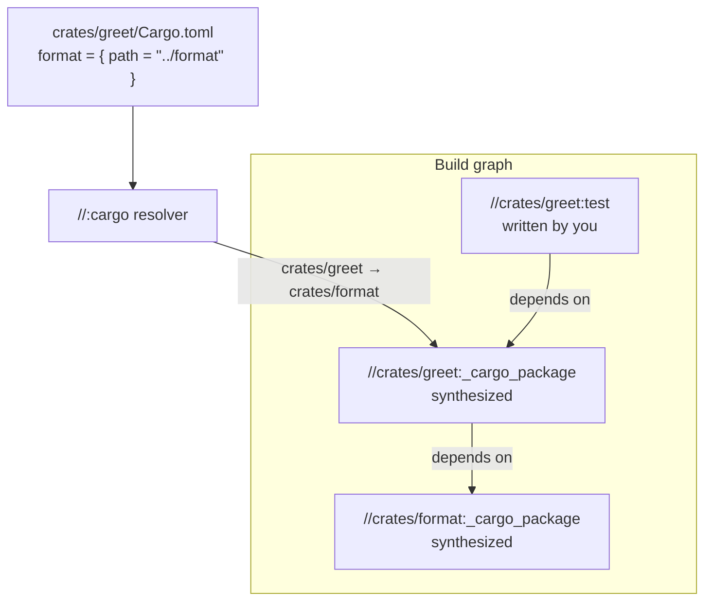

import { Aside, Tabs, TabItem } from "@astrojs/starlight/components";

Most monorepos state their internal dependency graph twice.
Once for the language's package manager:

```toml
# crates/greet/Cargo.toml
[dependencies]
format = { path = "../format" }
```

and once for Grog:

```starlark
# crates/greet/BUILD.star
cargo_crate(name = "greet", deps = ["//crates/format"])
```

Naturally, this isn't great because the Grog graph can get out of sync causing cache-misses or incorrect cache hits.

This is why Grog provides customizable **dependency resolvers** that allow syncing language dependencies into the Grog build graph.

## Quick start

Declare a resolver in any BUILD file (typically the workspace root) to use it.

`cargo` is [built in](#built-in-resolvers), so the declaration is a name and a command:

<Tabs syncKey="build-file-format">
  <TabItem label="YAML">

```yaml
# BUILD.yaml at the workspace root
dependency_resolvers:
  - name: cargo
    command: builtin::cargo
```

  </TabItem>
  <TabItem label="Starlark">

```starlark
# BUILD.star at the workspace root
dependency_resolver(
    name = "cargo",
    command = "builtin::cargo",
)
```

  </TabItem>
  <TabItem label="Pkl">

```pkl
// BUILD.pkl at the workspace root
amends "@grog/package.pkl"

dependency_resolvers {
  new {
    name = "cargo"
    command = "builtin::cargo"
  }
}
```

  </TabItem>
</Tabs>

Every crate in the workspace now has an implicit target `//crates/<name>:_cargo_package` that groups the relevant input files.
Its inputs come from the crate's layout and its dependencies from the crate's `path` entries, and it exists whether or not the crate has a BUILD
file:

```bash
$ grog deps //crates/cli:_cargo_package
//crates/greet:_cargo_package
```

## How the wiring works

A resolver is a small program that reports, for each package directory, the directories it depends on and, optionally, the files that make it up.
Grog uses this information to build pseudo targets on the fly for its dependency graph.

Paths are relative to the package the resolver is declared in.
`//:cargo` at the repo root reports workspace-relative paths, while `crates/format` from `//tools/rust:cargo` means `tools/rust/crates/format`.


```mermaid
flowchart TD
  M["crates/greet/Cargo.toml<br/>format = { path = &quot;../format&quot; }"] --> R["//:cargo resolver"]
  R -->|"crates/greet → crates/format"| G
  subgraph buildGraph["Build graph"]
    T["//crates/greet:test<br/>written by you"] -->|depends on| G["//crates/greet:_cargo_package<br/>synthesized"]
    G -->|depends on| F["//crates/format:_cargo_package<br/>synthesized"]
  end
```

Your own targets only depend on their package's filegroup, e.g. `//crates/greet:test` on `:_cargo_package`.
The edge to `crates/format` comes from the resolver, so a change there still invalidates the test.

For each package the resolver reports `inputs` for, Grog synthesizes a filegroup, e.g. `//crates/format:_cargo_package`, and wires the edges between them.
Its name is the resolver's `generated_target_name`, which defaults to `_<resolver name>_package`.
This works in directories without a BUILD file.
A package reported without `inputs` gets no filegroup, which is only an error once something depends on it.

### Using your own target instead

If you know a package's inputs better than the resolver, e.g. because it has a generated directory, register your own target in its place:

```starlark
# crates/greet/BUILD.star
target(
    name = "lib",
    inputs = ["src/**/*.rs", "gen/**/*.rs", "Cargo.toml"],
    dependency_resolvers = ["//:cargo"],
)
```

`//crates/greet:lib` now replaces `:_cargo_package`: it receives the package's edges, and other packages' edges point at it.
The resolver's `inputs` for the package are ignored.
Only one target per package may register a given resolver, but a target may register with several and receives the union of their edges.

## Built-in resolvers

Grog ships four resolvers.
Use one with `command = "builtin:<name>"` and omit `inputs` to get the defaults listed below.
Every built-in declares inputs for the packages it reports, so workspace members don't need a BUILD file.

| Name    | Reads                                                                                              | Needs a toolchain |
| ------- | -------------------------------------------------------------------------------------------------- | ----------------- |
| `cargo` | The workspace `Cargo.toml` members and each member's `[dependencies]` / `[build-dependencies]`     | no                |
| `uv`    | `uv.lock` — packages with an `editable` or `directory` source are workspace members                | no                |
| `node`  | `pnpm-workspace.yaml`, or `workspaces` in the root `package.json`, plus each member's dependencies | no                |
| `go`    | `go list -deps -e -json ./...`, keeping imports under the module path                              | yes (`go`)        |

`cargo`, `uv` and `node` parse manifests and lockfiles directly, so `grog changes` works on a CI image without Cargo, uv or Node.

### cargo

Members are `[workspace] members` minus `exclude`, plus the root package if the root manifest has a `[package]` table.
Edges are `path` dependencies between members, including `workspace = true` entries resolved through `[workspace.dependencies]`.

`[dev-dependencies]` are skipped.
Cargo allows a dev-dependency to point back at a dependant, which would be a cycle in Grog.
If a test needs a crate that isn't a normal dependency, add its label to the test target by hand.

Default `inputs`: `Cargo.toml`, `Cargo.lock`, and `<pattern>/Cargo.toml` for every `members` pattern.

Each crate's `:_cargo_package` filegroup covers `Cargo.toml`, `build.rs`, `src/**/*`, `tests/**/*`, `benches/**/*`, `examples/**/*`, `[lib] path`, `[[bin]] path` and `[package] include`.
Files a crate doesn't have are skipped, so the list errs broad: an extra glob is free, a missing one under-invalidates.

### uv

Members are the `uv.lock` packages with an `{ editable = "<dir>" }` or `{ directory = "<dir>" }` source.
Edges are their `dependencies` that name other members.
Dev groups are skipped, since test-only edges back to a dependant are a common source of cycles.
uv doesn't forbid cycles between members, though, so a cycle through regular `dependencies` still fails the load.

Default `inputs`: `uv.lock`, `pyproject.toml`.

<Aside type="caution">
  The resolver reads the lockfile, not your imports. A stale `uv.lock` means a stale graph, so run
  `uv sync` or set `UV_LOCKED=1` in CI.
</Aside>

### node

Covers npm, yarn and pnpm workspaces.
Members come from `pnpm-workspace.yaml`, falling back to `workspaces` in the root `package.json`.
Edges are `dependencies`, `devDependencies` and `peerDependencies` entries that name another member; pnpm's `workspace:*` is treated like any other version spec.
None of the package managers forbid cycles between members, and one through any of these fields fails the load.

Default `inputs`: `pnpm-workspace.yaml`, `aube-workspace.yaml`, `package.json`, `*/package.json`,
`*/*/package.json`.

### go

Edges are imports between packages inside your module(s), as reported by `go list`.
Every `.go` file counts, including ones excluded by build constraints, so the graph is the same for every `GOOS`, `GOARCH` and tag set.
Test-only imports are skipped for the same cycle reason as Cargo's `[dev-dependencies]`.

This is the only built-in that shells out to its toolchain, so it's the slowest on a large repo and gains the most from [caching](#caching).

Default `inputs`: `go.mod`, `go.sum`, `go.work`, `**/*.go`.

## Fields reference

### Target field

| Field                  | Type      | Description                                                                                    |
| ---------------------- | --------- | ---------------------------------------------------------------------------------------------- |
| `dependency_resolvers` | `label[]` | Resolvers this target registers with. Their edges for its package are added to `dependencies`. |

Normal label rules apply: `":cargo"` is a resolver in the same package, `"//:cargo"` one at the workspace root.
Supported in every BUILD format and in [Grog script](/topics/grog-scripts) annotations.

### Resolver declaration

Resolvers are declared in a BUILD file next to `targets`, `aliases` and `resources`:

<Tabs syncKey="build-file-format">
  <TabItem label="YAML">

```yaml
dependency_resolvers:
  - name: cargo
    command: builtin::cargo
    inputs:
      - Cargo.toml
      - Cargo.lock
      - crates/*/Cargo.toml
```

  </TabItem>
  <TabItem label="Starlark">

```starlark
dependency_resolver(
    name = "cargo",
    command = "builtin::cargo",
    inputs = ["Cargo.toml", "Cargo.lock", "crates/*/Cargo.toml"],
)
```

  </TabItem>
  <TabItem label="Pkl">

```pkl
dependency_resolvers {
  new {
    name = "cargo"
    command = "builtin::cargo"
    inputs {
      "Cargo.toml"
      "Cargo.lock"
      "crates/*/Cargo.toml"
    }
  }
}
```

  </TabItem>
</Tabs>

| Field                   | Type       | Description                                                                                              |
| ----------------------- | ---------- | -------------------------------------------------------------------------------------------------------- |
| `name`                  | `string`   | Unique within the package, shared namespace with targets, aliases and resources.                         |
| `command`               | `string`   | Shell command that prints the [mapping](#the-resolver-protocol) to stdout, or `builtin:<name>`.          |
| `inputs`                | `string[]` | Globs relative to the declaring package that form the [cache key](#caching). Defaults to the built-in's. |
| `timeout`               | `string`   | Defaults to `60s`. Resolvers run on read-only commands like `grog deps`, so they must not hang.          |
| `generated_target_name` | `string`   | Name of the filegroup synthesized for a package that registers no target. Defaults to `_<name>_package`. |

<Aside type="note" title="A resolver is not a build target">
  Resolvers are loaded, never scheduled. They have no `dependencies` or `outputs`, `grog build
  //...` skips them, and `grog deps` doesn't list them. This keeps `grog deps`, `grog changes` and
  shell completion from triggering a build. A resolver that needs generated code must generate it
  itself.
</Aside>

## Tweaking the built-ins

### Narrowing the inputs

The default globs are broad and resolved on every load; a `**` pattern over a large repo is a second tree walk.
Narrow them where you can:

```starlark
dependency_resolver(
    name = "cargo",
    command = "builtin::cargo",
    inputs = ["Cargo.toml", "Cargo.lock", "crates/*/Cargo.toml"],
)
```

### A second workspace of the same ecosystem

Declare another resolver in that workspace's package.
Its paths are relative to where it's declared, so nothing else needs configuring:

```starlark
# tools/rust/BUILD.star
dependency_resolver(name = "cargo", command = "builtin::cargo")
```

```starlark
# tools/rust/crates/codegen/BUILD.star
target(name = "codegen", dependency_resolvers = ["//tools/rust:cargo"], ...)
```

### Replacing a built-in

Point `command` at your own program:

```starlark
dependency_resolver(
    name = "cargo",
    command = "python3 tools/grog/cargo_resolver.py",
    inputs = ["Cargo.toml", "crates/*/Cargo.toml"],
)
```

## Writing a custom resolver

A resolver is any command that prints a JSON document to stdout.
There is no plugin API.

1. Write a program, in any language, that prints the [document](#the-resolver-protocol).
2. Declare it with `dependency_resolver` and list the files its output depends on as `inputs`.
3. Either emit `inputs` per package so Grog synthesizes filegroups, or register a target in each package.
4. Check the result with `grog check` (package and edge counts) and `grog deps` (merged edges).

### The resolver protocol

**Requirements.**
Resolvers run while loading the graph, on every command that reads it, and their output is cached.
That makes the following rules:

1. **Side-effect free.** Resolvers may run concurrently and don't run at all on a cache hit, so nothing may rely on them having run.
   Never write to the workspace; bare `cargo metadata`, for example, rewrites `Cargo.lock` unless given `--locked`.
2. **Deterministic.** Same inputs, same bytes. Absolute paths, timestamps or unordered maps in the output churn the cache.
3. **stdout is the document only.** Send diagnostics to stderr: Grog prints it verbatim on failure and logs it at debug level on success.
4. **Non-interactive.** stdin is the null device. A resolver that waits for input hangs every `grog` command, including shell completion.
5. **Bounded.** Finish within the declaration's `timeout`.
6. **Complete.** Report every edge whose change should rebuild the importing package, conditional ones included, and every file that belongs to a package you declare `inputs` for.
   Nothing downstream can detect an omission, so over-approximate like the built-ins do.

**Invocation.**
The command runs through the same shell as target commands, including the default `set -eu` (see [`disable_default_shell_flags`](/reference/configuration)).
The working directory is the declaring package.
The environment matches a target command's: the process environment, `grog.toml` `environment_variables`, the `GROG_*` variables and `GROG_RESOLVER_LABEL`.

**Output.** One JSON document on stdout:

```json
{
  "version": 1,
  "packages": {
    "crates/cli": { "dependencies": ["crates/greet"], "inputs": ["src/**/*", "Cargo.toml"] },
    "crates/format": { "dependencies": [], "inputs": ["src/**/*", "Cargo.toml"] },
    "crates/greet": { "dependencies": ["crates/format"], "inputs": ["src/**/*", "Cargo.toml"] },
    "crates/server": { "dependencies": ["crates/greet"], "inputs": ["src/**/*", "Cargo.toml"] }
  }
}
```

- Keys are **directory paths** relative to the declaring package; `""` is the declaring package itself.
- Paths are relative and `/`-separated, with no leading `./`, trailing `/` or `..` segment.
  Absolute or escaping paths are a load error.
- `dependencies` entries are paths too, except that an entry starting with `//` is a literal Grog label.
  Use it to point at a specific target instead of a package's stand-in.
- `inputs` are globs relative to **the described package**, not the declaring one.
  They're only used when no target in that package registers the resolver (see [how the wiring works](#how-the-wiring-works)); an empty list equals omitting them.
- An omitted package is the same as one with no `dependencies`. List every member anyway so `grog check` counts are meaningful.
- Self-dependencies are dropped.
- Order doesn't matter; Grog sorts every list, so shuffled output doesn't churn the cache.
- Unknown fields are ignored. `version` is required.

**Exit status.**
Exit zero with a valid document, or non-zero with a message on stderr.
There is no partial success: a resolver that can't determine the whole graph must fail rather than emit a subset.

### Example: a protobuf resolver

[`examples/custom_resolver`](https://github.com/chrismatix/grog/tree/main/examples/custom_resolver) has three protobuf packages whose imports form a chain, one of them without a BUILD file.
Its resolver maps each package to the directories its `.proto` files import, and declares `*.proto` as the package's inputs:

```python
#!/usr/bin/env python3
# tools/resolve_proto_imports.py
import json
import re
import sys
from pathlib import Path

IMPORT = re.compile(r'^import "([^"]+)";', re.MULTILINE)

packages = {}
for proto_file in sorted(Path("proto").rglob("*.proto")):
    package_directory = proto_file.parent.as_posix()
    imported_directories = {
        Path(imported).parent.as_posix() for imported in IMPORT.findall(proto_file.read_text())
    }
    packages[package_directory] = {
        "dependencies": sorted(imported_directories - {package_directory}),
        "inputs": ["*.proto"],
    }

json.dump({"version": 1, "packages": packages}, sys.stdout)
```

Declare it with the files its output depends on, including the script itself:

<Tabs syncKey="build-file-format">
  <TabItem label="YAML">

```yaml
# BUILD.yaml at the workspace root
dependency_resolvers:
  - name: protos
    command: python3 tools/resolve_proto_imports.py
    inputs:
      - tools/resolve_proto_imports.py
      - proto/*/*.proto
```

  </TabItem>
  <TabItem label="Starlark">

```starlark
# BUILD.star at the workspace root
dependency_resolver(
    name = "protos",
    command = "python3 tools/resolve_proto_imports.py",
    inputs = ["tools/resolve_proto_imports.py", "proto/*/*.proto"],
)
```

  </TabItem>
  <TabItem label="Pkl">

```pkl
// BUILD.pkl at the workspace root
amends "@grog/package.pkl"

dependency_resolvers {
  new {
    name = "protos"
    command = "python3 tools/resolve_proto_imports.py"
    inputs {
      "tools/resolve_proto_imports.py"
      "proto/*/*.proto"
    }
  }
}
```

  </TabItem>
</Tabs>

Every package now has a `:_protos_package` filegroup, and a consuming target depends on nothing else:

```yaml
# proto/order/BUILD.yaml
targets:
  - name: generate
    command: grep -h '^message' *.proto > messages.txt
    dependencies:
      - :_protos_package
    outputs:
      - messages.txt
```

`proto/base` has no BUILD file, yet `grog build //...` reports the critical path
`//proto/base:_protos_package -> //proto/user:_protos_package -> //proto/order:_protos_package -> //proto/order:generate`.

<Aside type="tip" title="Cross-language often needs no custom resolver">
  If the generated code is itself a workspace member, like `lib/proto` in the [uv
  example](https://github.com/chrismatix/grog/tree/main/examples/python_uv_monorepo), the language
  resolver already emits the edge.
</Aside>

## Caching

Resolvers run at load time, so they cost something on every `grog build`, `grog test`, `grog changes` and shell completion.
Grog caches their output like target output.

The cache key covers the protocol version, the resolver's label and `command`, the Grog version for `builtin:` commands, and the contents of every file matching `inputs`.
A custom resolver's own script is not hashed automatically: list it in `inputs`, or edits to it keep serving the cached mapping.

The cached value is the resolver's stdout, stored in the [content-addressable store](/topics/remote-caching).
With a remote cache, a cold CI runner downloads the mapping instead of running `go list`.

|                      | Work                                                    |
| -------------------- | ------------------------------------------------------- |
| Cache hit            | Hash the `inputs` files, one cache read, one JSON parse |
| Cache miss           | The above plus one subprocess                           |
| No resolver declared | Nothing                                                 |

Failed runs are never cached.
`--enable-cache=false` disables resolver caching along with everything else.

## Using a committed mapping

To skip running a tool at load time entirely, commit the mapping and `cat` it:

```starlark
# BUILD.star at the workspace root
dependency_resolver(
    name = "cargo",
    command = "cat tools/grog/inferred-deps.json",
    inputs = ["tools/grog/inferred-deps.json"],
)
```

Regenerate it with an ordinary target:

```yaml
# tools/grog/BUILD.yaml
targets:
  - name: inferred-deps
    command: python3 cargo_resolver.py > inferred-deps.json
    inputs:
      - cargo_resolver.py
    dependencies:
      - //:workspace
    outputs:
      - inferred-deps.json
```

This needs no toolchain at load time, but the file can drift between regenerations.

## Inspecting and troubleshooting

Inferred edges are ordinary dependencies, so every query command shows them:

```bash
grog deps //crates/cli:cli          # direct dependencies, inferred ones included
grog rdeps //crates/format:format   # who depends on this crate
grog graph -o mermaid               # the whole graph
```

`grog check` runs every referenced resolver and summarizes the result:

```bash
$ grog check
resolver //:cargo: builtin::cargo, cache hit, 4 packages, 3 edges
Build graph is valid.
```

`--log-level debug` prints each resolver's command, cache key and full mapping.

### Errors

| Message                                                                                                                                             | Fix                                                                                                          |
| --------------------------------------------------------------------------------------------------------------------------------------------------- | ------------------------------------------------------------------------------------------------------------ |
| `no dependency resolver at //:cargo2 (referenced by //crates/cli:cli); declared: //:cargo, //:proto`                                                | Fix the label or declare the resolver.                                                                       |
| `resolver //:cargo registered twice in package crates/cli: //crates/cli:cli and //crates/cli:build`                                                 | Only one target per package may register. Register one and have the others depend on it.                     |
| `resolver //:cargo reports crates/greet depends on crates/format, which has no target registered for //:cargo and no inputs to synthesize one from` | Register a target in `crates/format`, have the resolver emit inputs for it, or remove it from the workspace. |
| `resolver //:cargo cannot synthesize //crates/format:_cargo_package: a target with that name is defined in crates/format/BUILD.yaml`                | Rename the hand-written target, or register it with the resolver so it becomes the endpoint.                 |
| `resolver //:cargo failed: exec: "cargo": executable file not found in $PATH`                                                                       | Install the tool, warm the remote cache, or use a [committed mapping](#using-a-committed-mapping).           |
| `cycle detected: //crates/a:a -> //crates/b:b -> //crates/a:a`                                                                                      | Usually a dev-dependency edge from a custom resolver. See [limitations](#limitations).                       |

A workspace member with no stand-in target is ignored, since a repo may contain packages Grog doesn't build.
It's only an error once something depends on it.

## Interaction with `grog changes`

[`grog changes`](/reference/commands) loads the graph at the current revision, so inferred edges are always current.

Adding a dependency usually edits a manifest that's already an input of the dependant target, so the change is detected normally and `--dependents=transitive` propagates it.
For manifests that aren't any target's input, such as a root workspace file adding or removing members, Grog falls back to a conservative rule: if any file matched by a resolver's `inputs` changed, every target registered with that resolver counts as changed.

## Limitations

- **Dev dependencies and test-only imports are skipped** by `cargo`, `uv` and `go`.
  All three ecosystems allow cycles there, and a package's edges land on its single stand-in, so importing them would turn a legal workspace into a Grog cycle.
  Add those labels to the test target by hand.
- **Cycles in the package graph itself fail the load.** Cargo and Go forbid them, but uv, npm, yarn and pnpm don't.
- **Conditional dependencies are included unconditionally.** A `cfg(windows)`-only crate is an edge on Linux too.
- **One registered target per resolver per package.** For different inferred graphs per target, split the package or add labels by hand.
- **A package needs a stand-in to be depended on**: a registered target, or resolver-declared `inputs`.
  A custom resolver that emits edges but no inputs needs a BUILD file in each package.
- **Resolvers can't depend on build outputs**, since they run before the build.
